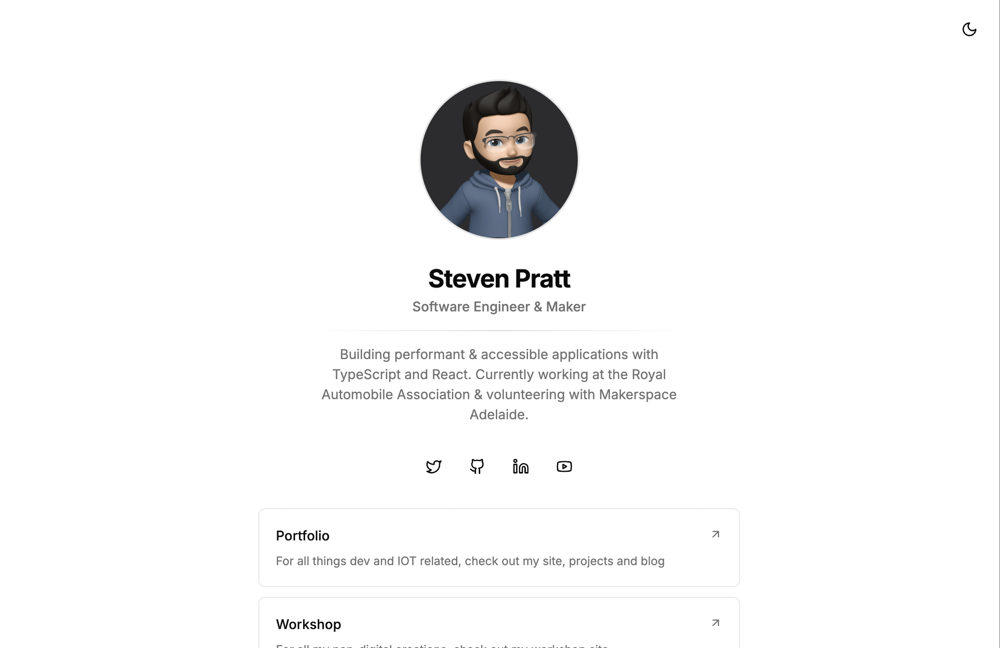

<h1 align="center">Welcome to Steve's Link Site 👋</h1>
<p>
  
  <a href="https://mit-license.org" target="_blank">
    
  </a>
  <a href="https://astro.build" target="_blank">
    
  </a>
  <a href="https://tailwindcss.com" target="_blank">
    
  </a>
  <a href="https://twitter.com/Steveful21" target="_blank">
    
  </a>
</p>

> A simple link-in-bio style site built with Astro and utilisising shadcn components.



### [See it live](links.steven-pratt.com)

## Install

```sh
npm install
```

## Usage

```sh
npm run dev
```

## Author

👤 **Steven Pratt**

- Website: stevenpratt.dev
- Twitter: [@Steveful21](https://twitter.com/Steveful21)
- Github: [@Steven-MP](https://github.com/Steven-MP)
- LinkedIn: [@steven-m-pratt](https://linkedin.com/in/steven-m-pratt)

## 📝 License

Copyright © 2025 [Steven Pratt](https://github.com/Steven-MP).<br />
This project is [MIT](https://mit-license.org) licensed.

---

_This README was generated with ❤️ by [readme-md-generator](https://github.com/kefranabg/readme-md-generator)_
